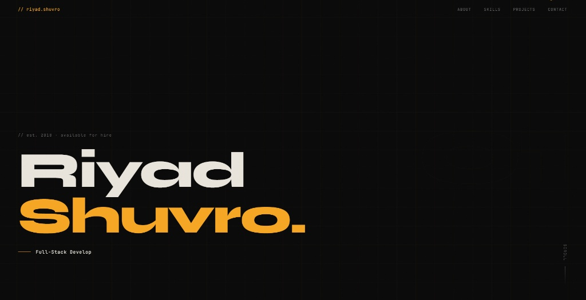

# 🚀 Modern Programmer Portfolio Template

A premium, developer-focused portfolio template built with **Vanilla HTML, CSS, and JavaScript**. Designed for impact with a brutalist-minimalist aesthetic, featuring smooth animations, a custom interaction system, and a mobile-first responsive layout.



## 🌟 Features

- **🎯 Custom Interaction System**: A reactive cursor that scales and interacts with hoverable elements.
- **⌨️ Dynamic Typewriter**: Showcases multiple roles or taglines on the hero section.
- **📜 Scroll Reveals**: Smooth entrance animations for sections using `IntersectionObserver`.
- **💻 Animated Code Preview**: A dedicated "featured project" slot with an automated code typing animation.
- **🎨 Premium Aesthetics**: Includes a custom grain overlay, grid-line background, and high-contrast typography.
- **📱 Fully Responsive**: Optimized for every screen size, from ultra-wide monitors to mobile devices.
- **⚡ Performance First**: Zero dependencies. No heavy frameworks, just pure, fast code.

## 🛠️ Tech Stack

- **Markup**: Semantic HTML5
- **Styling**: Vanilla CSS3 (Custom Properties, Flexbox, Grid)
- **Logic**: Vanilla JavaScript (ES6+)
- **Typography**: [Syne](https://fonts.google.com/specimen/Syne) & [JetBrains Mono](https://fonts.google.com/specimen/JetBrains+Mono)

## 🚀 Getting Started

### 1. Clone the Repository

```bash
git clone https://github.com/redNSF/programmer-portfolio.git
cd programmer-portfolio
```

### 2. Run Locally

Since this is a static site, you can simply open `index.html` in your browser. However, for the best experience (and to avoid CORS issues if you add modules later), use a local server:

- **VS Code**: Use the [Live Server](https://marketplace.visualstudio.com/items?itemName=ritwickdey.LiveServer) extension.
- **Python**: `python -m http.server 8000`
- **Node**: `npx serve .`

## 🎨 Customization Guide

This project is built to be easily customized. Follow these steps to make it your own:

### 1. Style & Colors (`style.css`)

Modify the CSS Variables in the `:root` selector to change the entire theme instantly:

```css
:root {
  --bg: #0a0a0a; /* Background color */
  --accent: #f5a623; /* Primary accent color */
  --text: #e8e4dc; /* Main text color */
  --mono: "JetBrains Mono", monospace;
}
```

### 2. Content (`index.html`)

Update the following sections with your own information:

- **Hero**: Change your name and the "EST" year.
- **About**: Update your bio and the stats (Years exp, Projects, etc.).
- **Skills**: Edit the `skill-card` blocks.
- **Projects**: Replace the placeholder projects with your real work.
- **Contact**: Update the `mailto:` link and social media URLs.

### 3. Interactive Logic (`script.js`)

- **Roles**: Change the strings in the `roles` array for the hero typewriter.
- **Code Animation**: Update the `lines` array in the `Animate code preview` section to show your own code snippet.

## 🚢 Deployment

The easiest way to deploy this portfolio is using **GitHub Pages**, **Vercel**, or **Netlify**.

### Deploy to GitHub Pages:

1. Push your code to a GitHub repository.
2. Go to **Settings > Pages**.
3. Select the `main` branch and `/ (root)` folder.
4. Click **Save**.

## 📄 License

Distributed under the MIT License. See `LICENSE` for more information.

---

**Designed & Built by [Riyad Shuvro](https://github.com/redNSF)**
